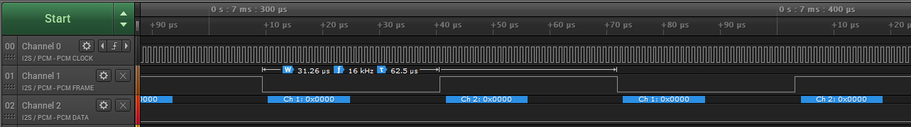

# Introduction

This Internet of Chuffs client is designed to stream audio from an I2S microphone (e.g. the ICS43432 MEMS microphone) connected to a Raspberry Pi over a cellular interface to an [ioc-server](https://github.com/RobMeades/ioc-server).  The instructions below cover the entire installation of the Raspberry Pi side of the system, including testing that the whole system works.

# Initial Linux Configuration
## Raspbian
First, load Raspbian into your Raspberry Pi.  I used the minimal image, no desktop, and once I'd created the SD card I also created an empty file on the `boot` partition called `SSH` (all in caps, no extension); this switches on SSH so, provided you can determine what IP address the Pi has been allocated, you can do everything else from an SSH terminal (default user name `pi` and default password `raspberry`).

If you are using a Pi Zero W with no Ethernet connector and so need to get at it over Wifi, create a file called `wpa_supplicant.conf` in the `boot` partition of the SD card and in that file put:

```
network={
    ssid="SSID"
    psk="password"
    key_mgmt=WPA-PSK
}
```
...where `SSID` is replaced by the SSID of your Wifi network and `password` is replaced by the password for your Wifi network.

## Set Up A User
Next, set up an admin user as follows:

`sudo adduser username`

...where `username` is replaced by the user you wish to add.  Add this to all the groups that are around with:

`sudo usermod username -a -G adm,dialout,cdrom,sudo,audio,video,plugdev,games,users,input,netdev,spi,i2c,gpio`

...where `username` is replaced by the user you added above.

Add this user to the sudo group by creating a file `/etc/sudoers.d/sudoers` and putting in it the single line `username  ALL=(ALL) ALL` (where `username` is replaced by the user you added above).

Set the permissions on that file to 0440 with:

`sudo chmod 0440 /etc/sudoers.d/sudoers`

Logout, log in again as the new user and verify that you can become root with:

`su -i`

Assuming you can, remove the `pi` user with:

`sudo deluser pi`

## Configure I2S
Configuration of the I2S interface on the Raspberry Pi is based on the instructions that can be found here:

http://www.raspberrypi.org/forums/viewtopic.php?f=44&t=91237

Edit `/boot/config.txt` to make sure that the following two lines are not commented-out:

```
#  Add audio and I2S audio at that
dtparam=audio=on
dtparam=i2s=on
```
## Build And Load The ICS43432 Microphone Driver
Next we need to build and load the ICS43432 microphone driver.  This is already available as part of the Linux source tree but is not built or loaded by default.

These steps are based on this blog post:

https://www.raspberrypi.org/forums/viewtopic.php?t=173640

Install a few required utilities:

```
sudo apt-get install bc
sudo apt-get install libncurses5-dev
```
Download the correct source version for your kernel and clean it up using the `rpi-source` utility as follows:

```
sudo wget https://raw.githubusercontent.com/notro/rpi-source/master/rpi-source -O /usr/bin/rpi-source
sudo chmod +x /usr/bin/rpi-source
/usr/bin/rpi-source -q --tag-update
rpi-source
```
If you receive an error like this:

`gcc version check: mismatch between gcc (6) and /proc/version (4.9.3)`

...where the GCC version is higher than the `/proc/version` version, then that's OK, just run `rpi-source` again with the parameter `--skip-gcc`.  `rpi-source` may ask you to install other things along the way; do what it says.  When it has completed, amongst other things, you should now have the following file:

`~/linux/sound/soc/codecs/ics43432.c`

Change to the Linux directory:

`cd linux`

Make a backup of your current `.config` file with:

`cp .config back.config`

Now run:

`make menuconfig`

Use the arrow keys to navigate down the menu tree as follows:

`Device drivers ---> Sound card support ---> Advance Linux Sound Architecture ---> ALSA for SoC audio support ---> CODEC drivers ---> InvenSense ICS43432 I2S microphone codec`

...and press the space bar to put an `m` against that entry.  Exit by pressing ESC lots of times, saving the `.config` file when prompted.

Now include this change and build the codecs module with:

```
make prepare
make M=sound/soc/codecs
```
Look in the `sound/soc/codecs` directory again and you should now see the file `snd-soc-ics43432.ko`.

Try adding the module manually with:

`sudo insmod sound/soc/codecs/snd-soc-ics43432.ko`

If this fails with the error `Could not insert module, invalid module format` then you've got the wrong version of Linux kernel source for the Linux binary you are using and you need to repeat this section.

NOTE: when you do `sudo apt-get upgrade` this might happen again if the Linux version changes as a result.  You can check the Linux version using `uname -r`; if the version has changed you need to re-download the Linux source with `rpi-source` and repeat the actions of this section to build a compatible `snd-soc-ics43432.ko` file.

Install the module with:

``sudo cp sound/soc/codecs/snd-soc-ics43432.ko /lib/modules/`uname -r`/``

Run `sudo depmod` so as to let Linux work out the dependencies.

Finally, to load the module at boot, edit the file `/etc/modules` to add the line:

`snd-soc-ics43432`

Reboot and use `lsmod` to check that the driver has been automatically loaded.  The output should look something like this:

```
Module                  Size  Used by
cfg80211              544545  0
rfkill                 20851  2 cfg80211
snd_bcm2835            24427  0
snd_soc_bcm2835_i2s     7480  0
bcm2835_gpiomem         3940  0
uio_pdrv_genirq         3923  0
uio                    10204  1 uio_pdrv_genirq
fixed                   3285  0
snd_soc_ics43432        2287  0
snd_soc_core          180471  2 snd_soc_ics43432,snd_soc_bcm2835_i2s
snd_compress           10384  1 snd_soc_core
snd_pcm_dmaengine       5894  1 snd_soc_core
snd_pcm                98501  4 snd_pcm_dmaengine,snd_soc_bcm2835_i2s,snd_bcm2835,snd_soc_core
snd_timer              23968  1 snd_pcm
snd                    70032  5 snd_compress,snd_timer,snd_bcm2835,snd_soc_core,snd_pcm
ip_tables              13161  0
x_tables               20578  1 ip_tables
ipv6                  408900  24
```
If `snd_soc_ics43432` does not appear in the list, check what went wrong during boot using `journalctl -b` and/or `dmesg`.

Now we need to create a device tree entry to make use of this driver.  Create a file `i2s-soundcard-overlay.dts` with this content:

```
/dts-v1/;
/plugin/;

/ {
    compatible = "brcm,bcm2708";

    fragment@0 {
        target = <&i2s>;
        __overlay__ {
            status = "okay";
        };
    };

    fragment@1 {
        target-path = "/";
        __overlay__ {
            card_codec: card-codec {
                #sound-dai-cells = <0>;
                compatible = "invensense,ics43432";
                status = "okay";
            };
        };
    };

    fragment@2 {
        target = <&sound>;
        master_overlay: __dormant__ {
            compatible = "simple-audio-card";
            simple-audio-card,format = "i2s";
            simple-audio-card,name = "soundcard";
            simple-audio-card,bitclock-master = <&dailink0_master>;
            simple-audio-card,frame-master = <&dailink0_master>;
            status = "okay";
            simple-audio-card,cpu {
                sound-dai = <&i2s>;
            };
            dailink0_master: simple-audio-card,codec {
                sound-dai = <&card_codec>;
            };
        };
    };

    fragment@3 {
        target = <&sound>;
        slave_overlay: __overlay__ {
                compatible = "simple-audio-card";
                simple-audio-card,format = "i2s";
                simple-audio-card,name = "soundcard";
                status = "okay";
                simple-audio-card,cpu {
                    sound-dai = <&i2s>;
                };
                dailink0_slave: simple-audio-card,codec {
                    sound-dai = <&card_codec>;
                };
        };
    };

    __overrides__ {
        alsaname = <&master_overlay>,"simple-audio-card,name",
                    <&slave_overlay>,"simple-audio-card,name";
        compatible = <&card_codec>,"compatible";
        master = <0>,"=2!3";
    };
};
```
Compile and install this as follows:

```
dtc -@ -I dts -O dtb -o i2s-soundcard.dtbo i2s-soundcard-overlay.dts
sudo cp i2s-soundcard.dtbo /boot/overlays
```
[Note: ignore the warnings that the dtc compilation process throws up].

Finally, edit the file `/boot/config.txt` to append the lines:

```
# Add the MEMS microphone
dtoverlay=i2s-soundcard,alsaname=mems-mic
```
Now reboot and then check for sound cards with:

`arecord -l`

...and you should see:

```
**** List of CAPTURE Hardware Devices ****
card 1: memsmic [mems-mic], device 0: bcm2835-i2s-ics43432-hifi ics43432-hifi-0 []
  Subdevices: 1/1
  Subdevice #0: subdevice #0
```
The output from `lsmod` should now look something like this:

```
Module                  Size  Used by
cfg80211              544545  0
rfkill                 20851  2 cfg80211
snd_soc_simple_card     6297  0
snd_soc_simple_card_utils     5196  1 snd_soc_simple_card
snd_bcm2835            24427  0
bcm2835_gpiomem         3940  0
snd_soc_bcm2835_i2s     7480  2
uio_pdrv_genirq         3923  0
fixed                   3285  0
uio                    10204  1 uio_pdrv_genirq
snd_soc_ics43432        2287  1
snd_soc_core          180471  4 snd_soc_ics43432,snd_soc_simple_card_utils,snd_soc_bcm2835_i2s,snd_soc_simple_card
snd_compress           10384  1 snd_soc_core
snd_pcm_dmaengine       5894  1 snd_soc_core
snd_pcm                98501  4 snd_pcm_dmaengine,snd_soc_bcm2835_i2s,snd_bcm2835,snd_soc_core
snd_timer              23968  1 snd_pcm
snd                    70032  5 snd_compress,snd_timer,snd_bcm2835,snd_soc_core,snd_pcm
ip_tables              13161  0
x_tables               20578  1 ip_tables
ipv6                  408900  24
```
## Connect An ICS43432 MEMS Microphone
The pins you need on the Raspberry Pi header are as follows:

* Pin 12: I2S clock
* Pin 35: I2S frame
* Pin 38: I2S data in
* Pin 39: ground
* Pin 1:  3.3V
* [Pin 40: I2S data out]

If you want to confirm that all is good, attach an oscilloscope or logic analyser to the pins and activate the pins by requesting a 10 second long recording with:

`arecord -Dhw:1 -c2 -r16000 -fS32_LE -twav -d10 -Vstereo test.wav`

You should see something like this:



Connect up your ICS43432 MEMS microphone, with the LR select pin grounded, and you should see data flowing something like this:


If you touch the microphone while the recording is running you should see the VU meter displayed in the SSH window change.

To make a proper capture you will need to configure for a mono microphone and a sensible recording level.  Create a file called `/etc/asound.conf` with the following contents:

```
pcm.mic_hw {
    type hw
    card memsmic
    channels 2
    format S32_LE
}
pcm.mic_sv {
    type softvol
    slave.pcm mic_hw
    control {
        name "Boost Capture Volume"
        card memsmic
    }
    min_dB -3.0
    max_dB 50.0
}
pcm.mic_mono {
    type multi
    slaves.a.pcm mic_sv
    slaves.a.channels 2
    bindings.0.slave a
    bindings.0.channel 0
}
```
Check that your configuration is correct by making a recording with this newly defined device:

`arecord -Dmic_sv -c2 -r16000 -fS32_LE -twav -d10 -Vstereo test.wav`

Now run `alsamixer`, call up the sound card menu by pressing `F6`, select `mems-mic` and then press the `TAB` key and set the Boost capture volume level (you can try using `F4` instead but that is often grabbed by the terminal program and hence may do other things).  Use the arrow keys to set a Boost of around 30 dB and press `ESC` to exit.

Now run another recording and, hopefully, you will get a better sound level in your `test.wav` file.

For the sections that follow, the device you want to stream audio from is `mic_hw`; the others we have used above are simply to allow verification of correct configuration with `arecord`.

## Developing With ALSA
This code is linked against the ALSA libraries so you'll need the ALSA development package.  Get this with:

`sudo apt-get install libasound2-dev`

## Download and Build ioc-client
Install git with:

`sudo apt-get install git`

Clone this repo with:

`git clone https://github.com/RobMeades/ioc-client`

Change to the `ioc-client` directory and run:

`sudo make`

You should end up with the binary `~/ioc-client/Debug/ioc-client`.

# Connecting To A Server
Before completing this section you will need to set up the server-side of the IoC, for which see https://github.com/RobMeades/ioc-server.  At this point you don't need the cellular interface connected provided there is some form of internet connectivity from your Raspberry Pi, e.g. Ethernet or Wifi.

Generate a key pair:

`ssh-keygen -f ~/ioc-client-key -t ecdsa -b 521`

Don't add a passphrase as we will need the Raspberry Pi to be able to use the key without manual passphrase entry.  Make sure the Raspberry Pi is on-line and copy the public key to the server with:

`ssh-copy-id -i ~/ioc-client-key user@host`

...replacing `user` with your username on the server and `host` with the IP address of the server.

Make sure that you can log in to the server from the Raspberry Pi using SSH and this key with:

`ssh -i ~/ioc-client-key user@host -p xxxx`

...again replacing `user` and `host` with the user name and IP address for the server, and adding `-p xxxx` with the remote port number if it is not port 22.  If you have problems, try adding the `-vvv` switch to `ssh` to find out what it's up to while running `journalctl -f` on the server to determine what it is seeing.

# Debugging End To End Connectivity
If you find that an SSH tunnel won't connect or there are other end-to-end connectivity issues, try falling back to basic TCP testing with `netcat`.  On the server side run:

`netcat -v -l xxxx`

...where `xxxx` is the port number to listen on.  If the SSH server is active on port 22 then stop it first, or maybe just try a different port number to start with.  On the client side run:

`netcat -v host xxxx`

...where `host` is replaced by the address of the server and `xxxx` is the port.  If a connection is made, both ends will say so.  Try all of this initially with the Ethernet connection of the Raspberry Pi plugged in but bare in mind that if your server is on the same network then you aren't really testing things.  Maybe try running the client-side netcat line on another Linux server on the internet, just to be sure that the server is visible.

If this works from the command line, make sure it also works in the systemd unit files by replacing the line that invokes the SSH client with the netcat client-side line.

# Using A USB Modem
First, edit `/boot/config.txt` to append the lines:

```
# Allow more power to be drawn from the USB ports, needed for cellular modem
max_usb_current=1
```
You'll find you need this in poor coverage conditions as cellular can draw more power than the Pi usually provides.  Then reboot.

Install `minicom` with:

`sudo apt-get install minicom`

Plug in your USB modem into one of the Raspberry Pi's USB ports.  I used a Hologram USB stick with a u-blox USB modem, which is a pure modem and requires no `usb-modeswitch` messing about.  I created a persistent device name for your USB stick using `udev`. With the USB stick plugged in, enter:

`lsusb`

Find the entry for your device.  Mine was:

`Bus 001 Device 006: ID 1546:1102 U-Blox AG`

Create a file `90-ioc.rules` in `/etc/udev/rules.d` with the following contents:

`ACTION=="add", KERNEL=="tty*", ATTRS{idVendor}=="1546", ATTRS{idProduct}=="1102", SYMLINK+="modem"`

...adjusting the numbers as necessary for your modem and making sure there is a newline at the end.  Reboot and check that `/dev` now includes the device `modem`.  If it doesn't, you can check if there are any errors reading the new rule with:

`udevadm test /dev/bus/001/006`

...replacing the values 001 and 006 as appropriate for your device.

Note: for reasons I don't understand, `minicom` and `wvdial` didn't play well with my `/dev/modem` device: they seemed to lock it (with a lock file in `/var/lock/`), then be unable to use it but leave it locked.  So you will see below that I continued to use `/dev/ttyACM0` with those applications.  The rules file, though, is still required, see later on.

Run `minicom` with:

`minicom -b115200 -D/dev/ttyACM0`

...and check that typing `AT` gets the response `OK`, just to confirm that your modem is talking to the Raspberry Pi.  Exit `minicom` with CTRL-A X

Now install PPP and a dialler with:

`sudo apt-get install ppp wvdial`

Edit the file `/etc/wvdial.conf` for your modem.  For my u-blox modem (on a Hologram USB stick with a Hologram SIM and hence a `hologram` APN) I used:

```
[Dialer Defaults]
Init1 = ATZ
Init2 = ATE0 +CMEE=2
Init3 = AT&C1 &D2
Init4 = AT+CGDCONT=1, "IP", "hologram"
Init5 = AT+IPR=460800
Modem Type = USB Modem
Baud = 460800
New PPPD = yes
Modem = /dev/ttyACM0
ISDN = 0
Phone = *99***1#
Password = "blank"
Username = "blank"
```
Test this with:

`sudo wvdial &`

You should see the AT commands go past, all followed by nice `OK`'s from the modem, then PPP should negotiate the connection, something like this:

```
--> Carrier detected.  Waiting for prompt.
~[7f]}#@!}!}!} }4}"}&} } } } }%}&MJJI}'}"}(}"C[19]~
--> PPP negotiation detected.
--> Starting pppd at Thu Feb  8 21:05:49 2018
--> Pid of pppd: 848
--> Using interface ppp0
--> pppd: ▒[07]R
--> pppd: ▒[07]R
--> pppd: ▒[07]R
--> local  IP address 10.170.210.39
--> pppd: ▒[07]R
--> remote IP address 10.170.210.39
--> pppd: ▒[07]R
--> primary   DNS address 212.9.0.135
--> pppd: ▒[07]R
--> secondary DNS address 212.9.0.136
--> pppd: ▒[07]R
```
...and the screen should stop scrolling.  Press <enter> to get back to the command prompt and type `ifconfig`.  You should now have a `ppp0` connection as well as the usual `eth0` etc.  To disconnect the PPP link and stop running-up your cellular bill, enter:

`ps aux | grep wvdial`

You'll get something like:

```
root       968  0.1  0.3   7228  3444 pts/0    S    21:10   0:00 sudo wvdial
root       972  0.2  0.4  10588  4240 pts/0    S    21:10   0:00 wvdial
root       973  0.0  0.2   3996  2068 pts/0    S    21:10   0:00 /usr/sbin/pppd 460800 modem crtscts defaultroute usehostname -detach user blank noipdefault call wvdial usepeerdns idle 0 logfd 6
```
Find the task number against the line `sudo wvdial` and kill that task; in my case:

`sudo kill 968`

You might have to:

`sudo kill 973`

...also.

You now have proven cellular connectivity.

# Web Server Setup
I set up web server with the thought that I might want to control the Raspberry Pi that way.  Install `nginx` with:

`sudo apt-get install nginx`

Enter the local IP address of your Raspberry Pi into a browser and you should see the default `nginx` page with "Welcome to nginx!" on the top in large friendly letters.

# Control Over Cellular
There is a remaining issue in that cellular networks won't generally accept incoming TCP connections.  The trick to fix this is, of course, another SSH tunnel but this time the other way around, where the tunnel listens for TCP connections on the remote machine and forwards them to the Raspberry Pi.

The command you want will be of the following form:

`ssh -o StrictHostKeyChecking=no -o "ConnectTimeout 10" -o "ServerAliveInterval 30" -o "ServerAliveCountMax 3" -N -R xxxx:localhost:yyyy -i /home/username/ioc-client-key -p zzzz user@url`

...where `xxxx` is the listening port on the remote machine, `yyyy` is the local port on the Raspberry Pi, `username` is replaced by your user name on the Raspberry Pi, `zzzz` is the SSH port number (if not 22), `user` is the username on the remote machine and `url` is the URL of the remove machine.  You probably want `xxxx` and `yyyy` to be something other than 80, in which case you must also edit the `nginx` configuration file `/etc/nginx/sites-enabled/default` and change the listening port as appropriate (and don't forget to `sudo service nginx restart` before testing it).

Once you've got the tunnel working, create a file called something like `/etc/systemd/system/http-tunnel.service` along the lines of the above, test it and enable it to start at boot like the others.  Then, on the remote machine, you should be able to open a browser and connect to `localhost:xxxx` to see the "Welcome to nginx!" page of the Raspberry Pi.  If you only have a command-line interface on the remote machine, you can test this with:

`curl -i -H "Accept: application/json" -H "Content-Type: application/json" http://localhost:xxxx`.

You might want to do a similar thing to allow SSH/SFTP access for the Raspberry Pi for more direct control.  Remember, when you `ssh` in from the remote machine, to specify the correct port number and your username on the Raspberry Pi:

`ssh -p xxxx -l username localhost`

...where `xxxx` is the listening port on the remote machine and `username` is your user name on the Raspberry Pi.

# Boot Setup
To start up the cellular connection and open an SSH tunnel to the server at boot, you need to create a couple of services.  First create the file `/lib/systemd/system/cellular.service` with contents as follows:

```
[Unit]
Description=Cellular connection
BindsTo=dev-modem.device
After=dev-modem.device
     
[Service]
ExecStart=wvdial
Restart=on-failure
RestartSec=3
StandardOutput=null
     
[Install]
WantedBy=multi-user.target
Alias=cellular.service
```
Note: if you have trouble with `wvdial`, change the `ExecStart` line to something like:

`ExecStart=wvdial > /home/username/wvdial.log 2>&1`
 
...where `username` is replaced by your user name, to get log output.
 
Edit the `/etc/udev/rules.d/90-ioc.rules` file you created above for the modem device so that it contains:

`ACTION=="add", KERNEL=="tty*", ATTRS{idVendor}=="1546", ATTRS{idProduct}=="1102", SYMLINK+="modem", TAG+="systemd", ENV{SYSTEMD_WANTS}="cellular.service"`

Test it with:

`sudo systemctl start cellular`

Your modem should connect to the cellular network and, if you run `ifconfig`, you should see the `ppp0` connection appear.  Shut it down again to save your cellular bill with:

`sudo systemctl stop cellular`

Create the file `/lib/systemd/system/urtp-tunnel.service` with contents as follows:

```
[Unit]
Description=SSH tunnel to server for URTP traffic
Wants=network-online.target
After=network-online.target

[Service]
ExecStart=/usr/bin/ssh -o StrictHostKeyChecking=no -o "ConnectTimeout 10" -o "ServerAliveInterval 30" -o "ServerAliveCountMax 3" -N -L xxxx:localhost:yyyy -i /home/username/ioc-client-key -p zzzz user@host
Restart=on-failure
RestartSec=3

[Install]
WantedBy=multi-user.target
```
...replacing `xxxx` with the local port for the SSH tunnel, `yyyy` with the remote port on the server for the SSH tunnel, `username` with your user name on the Raspberry Pi, adding `-p zzzz` if SSH is not on port 22, replacing `user` with your user name on the server and `host` with the IP address/URL of the server.

Before you start the service, cut and paste your finalised `ExecStart` line and execute it on the command line directly with `sudo`.  This will add the fingerprint of the server to the root account.

Now test that the tunnel comes up correctly with:

`sudo systemctl start urtp-tunnel`

Check on the server end (e.g. by running `journalctl -f`) that the connection is successful.  If you have trouble, add the `-vvv` switch to the `ssh` command line above, do a `sudo systemctl daemon-reload`, start the service again and look at the output on the Raspberry Pi with `journalctl -b`.

Enable the tunnel to start at boot with:

`sudo systemctl enable urtp-tunnel`

Reboot and check that the tunnel is open (this will be over Ethernet).  If that is successful, enable the cellular service to start at boot with:

`sudo systemctl enable cellular`

Reboot without Ethernet/wifi connectivity from the Raspberry Pi and check that the tunnel opens over the cellular connection.  If you have any issues, use `sudo systemctl status cellular` and `journalctl -b` to find out what's up.

**FROM NOW ON YOUR CELLULAR MODEM WILL CONNECT AT BOOT AND YOU MUST RUN `sudo systemctl stop cellular` TO STOP IT**.  If you want to be sure you don't waste money, disable this until you really need it with:

`sudo systemctl disable cellular`

...and of course run `sudo systemctl stop cellular` to stop the current instance.  Or just leave the cellular modem disconnected from the Raspberry Pi, to be quite sure.

If you need to open other tunnelling ports (e.g. to upload log files from the `ioc-client`) then repeat the process of creating a systemd unit file for the additional tunnels.

Once you have everything running sweetly, create another `systemctl` unit file that starts the `ioc-client` at boot by creating a file called something like `/lib/systemd/system/ioc-client.service` with contents something like:

```
[Unit]
Description=IoC client

[Service]
ExecStart=/home/username/ioc-client/Debug/ioc-client mic_hw ioc_server:port -ls log_server:port -ld log_directory_path
Restart=on-failure
RestartSec=3
KillSig=SIGINT

[Install]
WantedBy=multi-user.target
```
...where `username` is replaced by your user name on the Raspberry Pi, `mic_hw` is the  device representing the I2S microphone, `ioc_server:port` is the URL where the [ioc-server](https://github.com/RobMeades/ioc-server) application is running, `log_server:port` is the URL where the [ioc logging server](https://github.com/RobMeades/ioc-log) is running and `log_directory_path` is a path where log files can be stored temporarily (probably in a sub-directory of `/home/username`).

Test that it works with:

`sudo systemctl start ioc-client`

...and then check its status with:

`sudo systemctl status ioc-client`

Finally, enable it to start at boot with:

`sudo systemctl enable ioc-client`

# Remote Access
I set up the Raspberry Pi to use a DDNS account at www.noip.com so that I can get to it remotely (though see "Control Over Cellular" above for the case where this is being done over cellular).  Do this by configuring a DDNS end point for the Raspberry Pi in your www.noip.com account.  Then download and build the Linux update client on the Raspberry Pi as follows:

```
wget https://www.noip.com/client/linux/noip-duc-linux.tar.gz
tar xzf noip-duc-linux.tar.gz
cd noip-2.1.9-1/
make
sudo make install
```
You will need to supply your www.noip.com account details and chose the correct DDNS entry to link to the Raspberry Pi.

Set permissions correctly with:

```
sudo chmod 700 /usr/local/bin/noip2
sudo chown root:root /usr/local/bin/noip2
sudo chmod 600 /usr/local/etc/no-ip2.conf
sudo chown root:root /usr/local/etc/no-ip2.conf
```
Create a file named `noip.service` in the `/etc/systemd/system/` directory with the following contents:

```
[Unit]
Description=No-ip.com dynamic IP address updater
After=network-online.target
After=syslog.target

[Install]
WantedBy=multi-user.target
Alias=noip.service

[Service]
# Start main service
ExecStart=/usr/local/bin/noip2
Restart=always
Type=forking
```
Check that the `noip` daemon starts correctly with:

`sudo systemctl start noip`

Your www.noip.com account should show that the update client has been in contact.  Reboot and check that the service has been started automatically with:

`sudo systemctl status noip`

...and by checking once more that your www.noip.com account shows that the update client has been in contact.

# A Note On the File boot/config.txt
I have seen my Raspberry Pi reset `boot/config.txt` to be an empty file.  Now that you've got all this working, I recommend that you back it up.

# Preventing Disk Corruption On Removal Of Power Without Shut Down
If power is removed from the Raspberry Pi before it has shut down there is a chance of SD card corruption.  And shutting the Raspberry Pi down in an organised way is not always possible.  One way to solve this conundrum is to put all the areas of the file system that must be written to into RAM and then make the SD card read-only.  This section describes how to do that based on:

https://narcisocerezo.wordpress.com/2014/06/25/create-a-robust-raspberry-pi-setup-for-24x7-operation/
http://blog.gegg.us/2014/03/a-raspbian-read-only-root-fs-howto/
https://www.raspberrypi.org/forums/viewtopic.php?f=28&t=154843

ALWAYS make a back-up copy of your SD card with something like [HDD Raw Copy Tool](http://hddguru.com/software/HDD-Raw-Copy-Tool/) or [dd](http://www.chrysocome.net/dd) before starting this process so that you can go back to that image in case of boot errors.  And of course, with this done, you will not be able to write changes to disk persistently so only do it once you've stopped fiddling with the set up.

Open `/etc/fstab` in your favourite editor.  It will look something like:

```
proc                  /proc           proc    defaults                                    0       0
PARTUUID=a2ac960e-01  /boot           vfat    defaults                                    0       2
PARTUUID=a2ac960e-02  /               ext4    defaults,noatime                            0       1
# a swapfile is not a swap partition, no line here
#   use  dphys-swapfile swap[on|off]  for that
```
Edit it to change `defaults` to `ro` and change the last number to 0 (to stop file system checks):

```
proc                  /proc           proc    defaults                                    0       0
PARTUUID=a2ac960e-01  /boot           vfat    ro                                          0       0
PARTUUID=a2ac960e-02  /               ext4    ro,noatime                                  0       0
# a swapfile is not a swap partition, no line here
#   use  dphys-swapfile swap[on|off]  for that
```
...and then append the following:

```
tmpfs    /tmp               tmpfs    defaults,noatime,mode=1777,size=200m                 0       0
tmpfs    /var/tmp           tmpfs    defaults,noatime,nosuid,size=200m                    0       0
tmpfs    /var/log           tmpfs    defaults,noatime,nosuid,mode=0755,size=50m           0       0
tmpfs    /var/lib/sudo      tmpfs    defaults,noatime,nosuid,mode=0755,size=2m            0       0
tmpfs    log_directory_path tmpfs    defaults,noatime,nosuid,mode=0755,size=2m            0       0
```
...where `log_directory_path` is replaced by the path to the `ioc-client` logging directory as specified above.  Alternatively, if you care about those logs you could create a separate partition for them or log them to an external USB drive.

Remove temporary `fake-hwclock` files by editing `/etc/cron.hourly/fake-hwclock` and putting the following as the first executable line after the initial comments:

```
# Switched off in order to set SD card to read only
exit 0
```
Move `logrotate` to somewhere writeable by editing `/etc/cron.daily/logrotate` to add `--state /var/log/logrotate.state` to its command-line e.g.:

```
#!/bin/sh

test -x /usr/sbin/logrotate || exit 0
/usr/sbin/logrotate --state /var/log/logrotate.state /etc/logrotate.conf
```
Disable `man` indexing by editing both `/etc/cron.weekly/man-db` and `/etc/cron.daily/man-db` and putting the following as the first executable line after the initial comments:

```
# Switched off in order to set SD card to read only
exit 0
```
Finally. stop the swap file from being used at next boot with:

```
sudo systemctl disable dphys-swapfile
```
Now take a deep breath and reboot.  If the system doesn't boot to a terminal log-in prompt, try attaching a screen and watching for what fails during boot, maybe taking a video of the text scrolling up the screen with your mobile phone (as the vital failed thing might scroll off the top).  You might be able to get away with attaching a keyboard to recover but, if not, go back to your backup and try again, remembering that things may have changed in Raspbian over time and so further research may be required to get this right.  Try performing the steps above individually, starting from the last one and working backwards, rebooting after each one to determine what's up.  Try not setting the partitions to `ro` and looking at what is failing to mount at boot with `journal -b`.  If you suspect that you've not captured all the things that need to be moved to `tmpfs`, install the `iostat` utility with `sudo apt-get install sysstat` and then run something like `iostat -m` to find out whether anything has been writing to the SD card (`mmcblk0`); you want the `MB_wrtn` entry to show `0`.  Unfortunately it is not possible to get a per-process view of what wrote to disk as the Raspbian kernel is not built with `auditd` support, so from here on trial/error and Google are your friends.

If you ever need to write to disk, update any packages, etc., remount `root` as writeable with:

`sudo mount -o remount,rw /`

...or remount `boot` as writeable with:

`sudo mount -o remount,rw /boot`